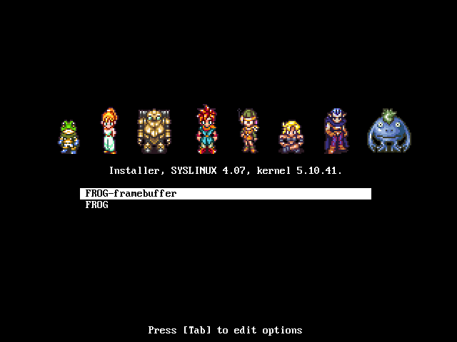
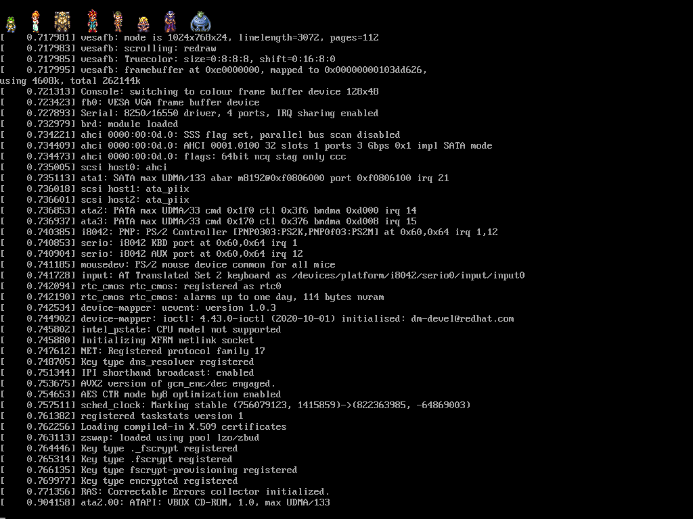
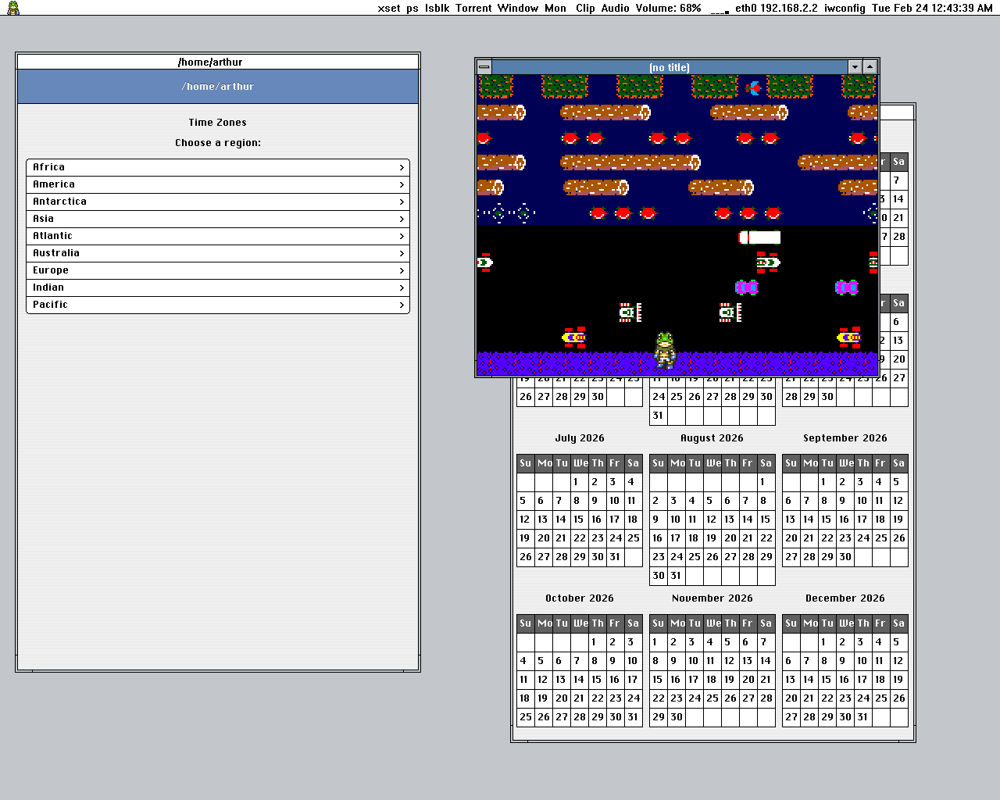

# FROG

FROG -- FROG Runs On GNU/Linux

  * Windows 3.0a style window frames
  * Custom lightweight Objective-C foundation
  * Bitmapped graphics, low DPI displays
  * Running on Linux and X11
  * Frog from Chrono Trigger
  * For now, classic Mac style widgets (i.e. buttons), but in the future it will be themed like Chrono Trigger


## Download

Installer ISO based on Slackware64

Boot with Legacy BIOS.

If using VirtualBox, 3D acceleration should be enabled.

This is a multilib system, the only 32-bit application included is Wine.

It comes with the 64-bit gcc only, so the included gcc cannot create 32 bit binaries.

It is a stripped down system that does not include systemd, elogind, polkit, pulseaudio, or NetworkManager.

http://8bitoperahouse.com/download/


## FROG USB stick

To write the image to a USB drive:

$ dd if=/path/to/file.iso of=/dev/sdX bs=1M

/path/to/file.iso is the file name of the image file.

/dev/sdX is the USB device to write the image to.

Run as root. Be careful not to write to the wrong drive.


## Overview

The goal is to have an OS that is stable and not constantly changing from year to year for no apparent reason.

FROG combines elements of Windows 3.0a and Chrono Trigger, to create a minimal desktop environment for Linux.


## How to compile and run

```
$ sh makeUtils.sh

$ perl build.pl
```

To run the window manager:

```
$ ./frog runWindowManager
```

To run the iPod style interface:

```
$ ./frog
```


## Notes

Some of the Perl scripts use the JSON module.


## Screenshot

The boot menu.



The number of characters at the top of the screen is equal to the number of CPU cores in the computer.



The desktop.




## Objective-C

Objective-C is the language used by NeXTStep. C and Objective-C are both extremely stable and do not change from year to year. Mixing C, Objective-C, C++, and Objective-C++ is easy.

FROG uses a custom lightweight Objective-C foundation on top of the GCC Objective-C runtime. The style of Objective-C is completely different from the one Apple uses. Everything is basically **id**.

Alternatively, it is possible to use an older version of the GNUstep Objective-C runtime that uses the old object struct layout (located in external/libobjc2). This requires everything to be compiled with clang, and allows for the use of Objective-C 2.0 features such as NSFastEnumeration and NSArray/NSDictionary literals, as well as blocks and libdispatch (with the appropriate libs). However, the GCC runtime has better performance, so it is the default.

FROG does not use Automatic Reference Counting. It causes problems with type-checking during compilation (it is too strict).


## Legal

Copyright (c) 2026 Arthur Choung. All rights reserved.

Email: arthur -at- 8bitoperahouse.com

Released under the GNU General Public License, version 3.

For details on the license, refer to the LICENSE file.

